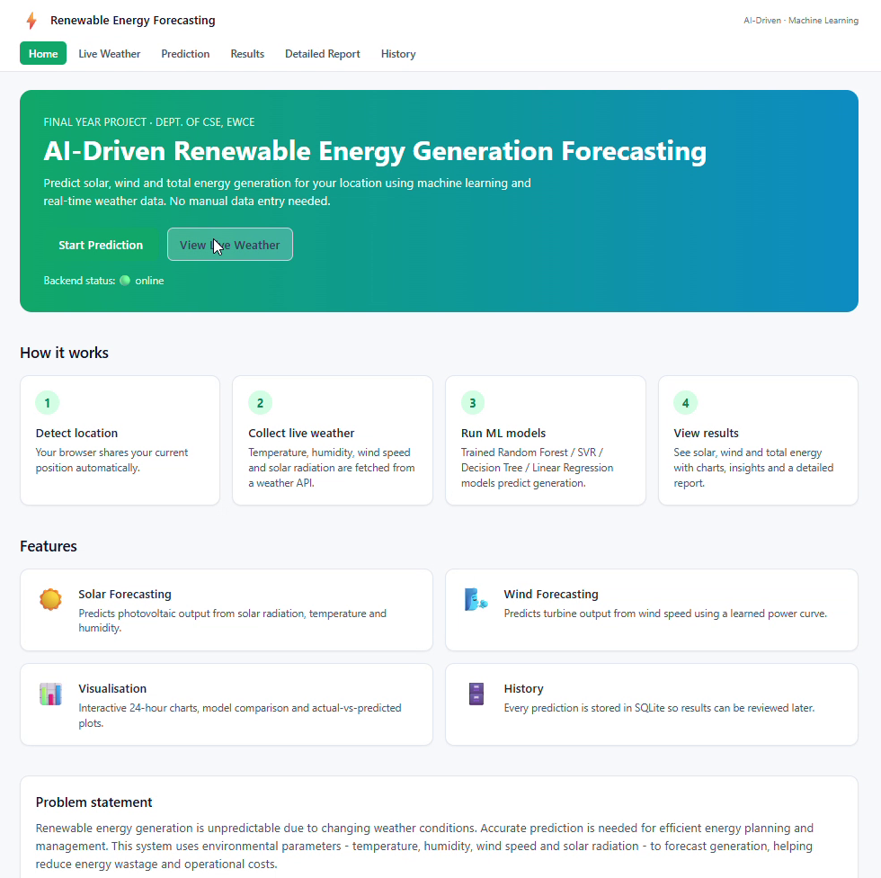
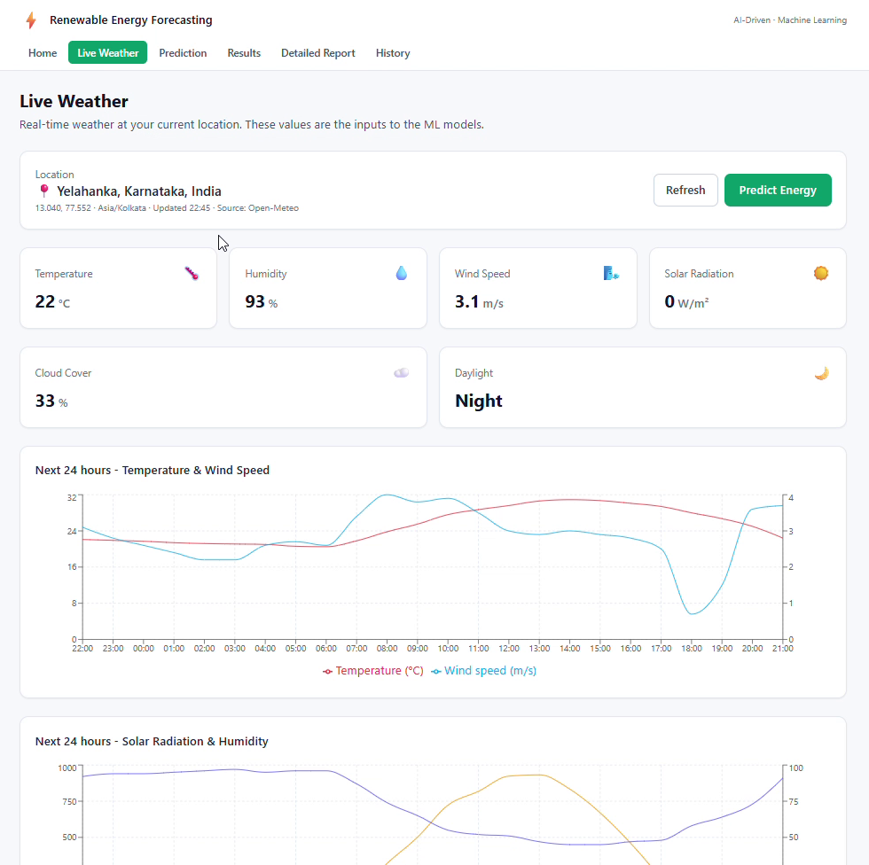
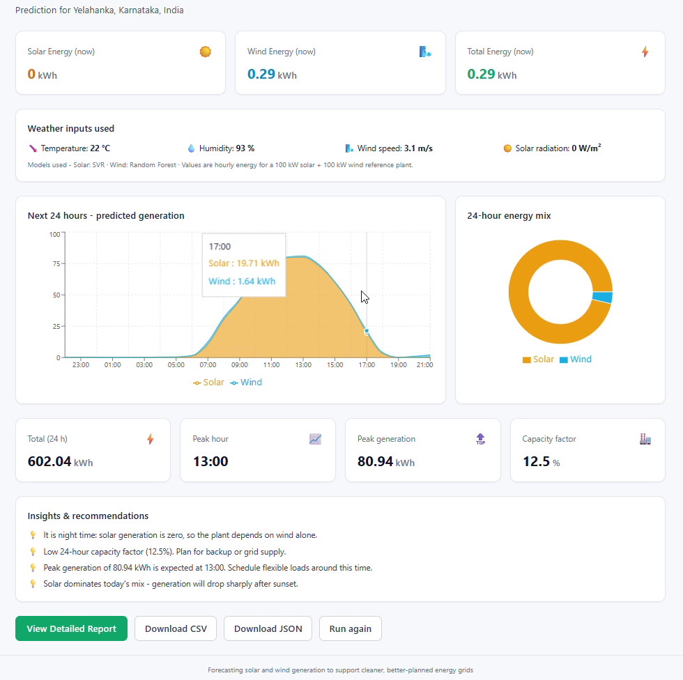
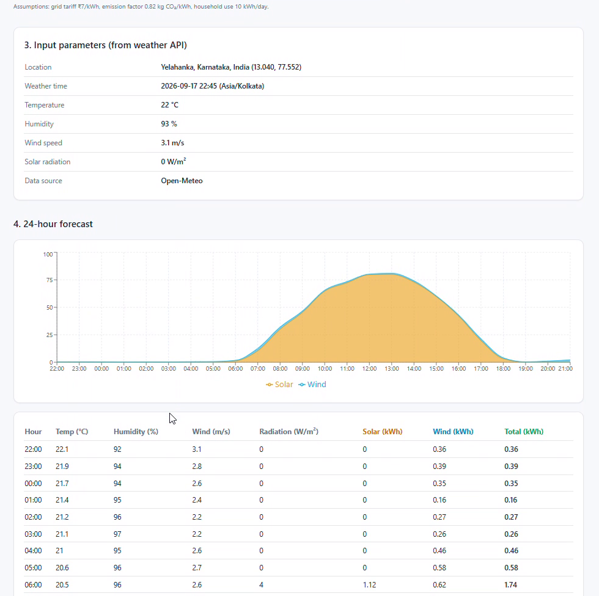
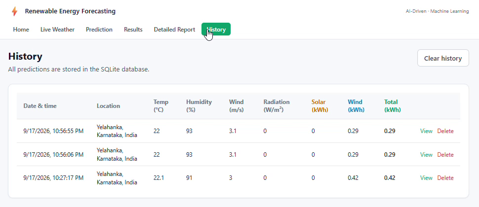
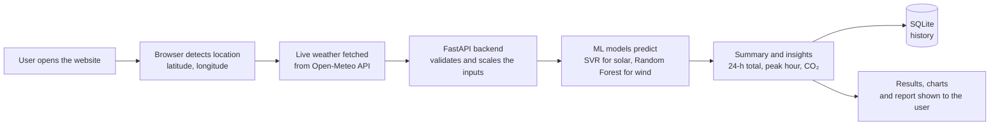
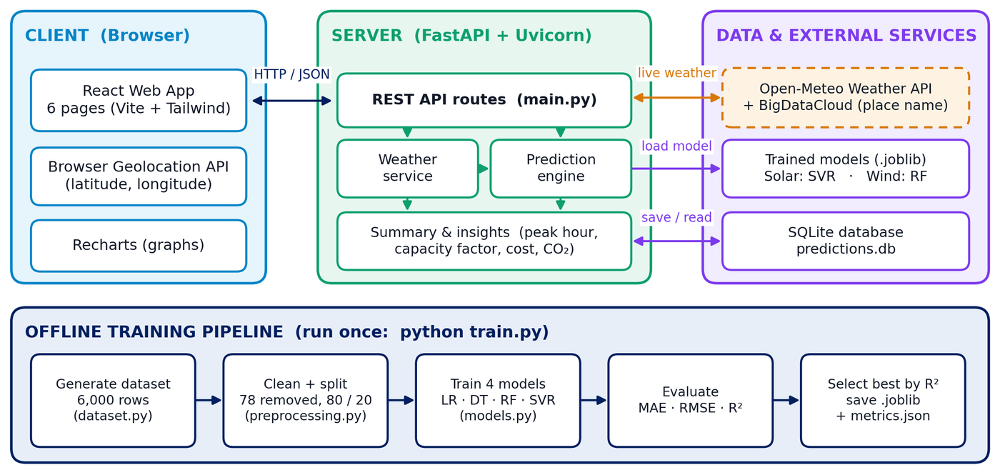
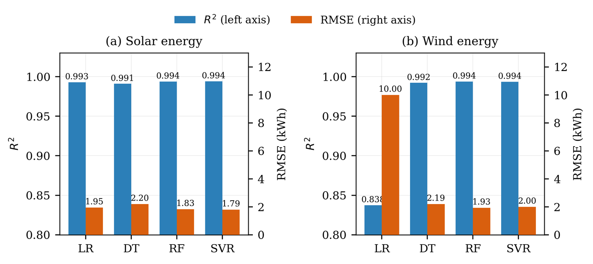
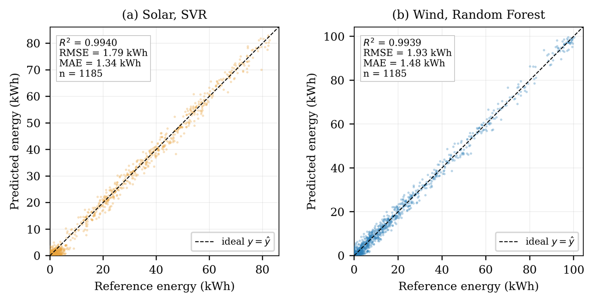

# AI-Driven Renewable Energy Generation Forecasting using Machine Learning Techniques

A web application that predicts **solar, wind and total renewable energy generation** for the user's current location using **live weather data** and **machine learning**. Nothing is typed in by hand: the browser finds the location, live weather is fetched automatically, and trained ML models predict the energy output for now and for the next 24 hours.

**🔗 Live demo:** https://renewable-energy-forecasting.vercel.app/


> **Note:** The backend is hosted on Render's free plan, which sleeps after 15 minutes without visitors. The first request after a break can take about a minute. If a prediction fails the first time, wait a moment and try again.

Final-year project, Department of Computer Science and Engineering, **East West College of Engineering, Bengaluru** (affiliated to VTU).

---

## Table of contents

1. [About the project](#about-the-project)
2. [Features](#features)
3. [Screenshots](#screenshots)
4. [How it works](#how-it-works)
5. [System architecture](#system-architecture)
6. [Tech stack](#tech-stack)
7. [Machine learning](#machine-learning)
8. [Project structure](#project-structure)
9. [API endpoints](#api-endpoints)
10. [Run the project locally](#run-the-project-locally)
11. [Running the tests](#running-the-tests)
12. [Deployment (Render + Vercel)](#deployment-render--vercel)
13. [Troubleshooting](#troubleshooting)
14. [Limitations and future enhancements](#limitations-and-future-enhancements)
15. [Team](#team)
16. [Acknowledgements](#acknowledgements)

---

## About the project

Solar and wind are clean energy sources, but their output keeps changing with the weather. Solar panels produce nothing at night and less on cloudy days, and wind turbines stop when the wind is too weak. Without a good forecast, energy planners cannot tell how much power will be available, which leads to wasted energy, higher costs and an unstable supply.

This project solves that problem with machine learning:

- The user opens the website and allows location access.
- The app fetches **live weather** (temperature, humidity, wind speed and solar radiation) for that location from the Open-Meteo API.
- Trained ML models predict how much **solar**, **wind** and **total** energy a reference plant (100 kW solar + 100 kW wind) would generate **now** and for **each of the next 24 hours**.
- Results are shown with charts, a detailed report, planning insights and a saved history.

## Features

- 📍 **Automatic location** using the browser's Geolocation API. No manual input.
- 🌦️ **Live weather** from the Open-Meteo API: current conditions plus a 24-hour forecast.
- 🤖 **Four ML algorithms compared**: Linear Regression, Decision Tree, Random Forest and SVR. The most accurate model is selected automatically.
- ⚡ **Solar, wind and total energy prediction** for the current hour.
- 📈 **24-hour forecast** with interactive charts (Recharts).
- 📋 **Detailed report**: peak hour, capacity factor, estimated energy value (₹), CO₂ saved and number of homes powered.
- 💡 **Insights and recommendations**, for example "night time, the plant depends on wind alone".
- 🗂️ **Prediction history** stored in an SQLite database, which you can view or delete.
- ⬇️ **Download** results as CSV or JSON, or print / save the report as PDF.
- 🛡️ **Clear error handling** when location is blocked or the weather service is unavailable.

## Screenshots

| Home                               | Live Weather                                       |
| ---------------------------------- | -------------------------------------------------- |
|  |  |

| Results                                  | Detailed Report                                 |
| ---------------------------------------- | ----------------------------------------------- |
|  |  |

**History**



## How it works



1. **Location**: the browser asks for permission and gets the latitude and longitude.
2. **Weather**: the browser fetches the current weather and the 24-hour forecast from Open-Meteo and sends it to the backend. If the browser can't reach the API, the backend fetches it itself, with retries.
3. **Pre-processing**: the four inputs (temperature, humidity, wind speed, solar radiation) are validated and scaled with the same `StandardScaler` used during training.
4. **Prediction**: the saved models predict energy for the current hour and for each of the next 24 hours.
5. **Output**: the backend calculates totals, the peak hour, capacity factor and insights, saves the result in SQLite and returns it to the frontend.

## System architecture



| Part                 | What it does                                                                                          |
| -------------------- | ----------------------------------------------------------------------------------------------------- |
| **Client (browser)** | React single-page app with 6 pages. Gets the location, fetches live weather and shows charts.         |
| **Server (FastAPI)** | REST API. Processes the weather data, runs the ML models and builds the summary, insights and report. |
| **ML models**        | `.joblib` files created by `train.py` (scaler + model pipelines).                                     |
| **Database**         | SQLite file `predictions.db` that stores every successful prediction.                                 |
| **External APIs**    | Open-Meteo (weather), BigDataCloud (place name from coordinates).                                     |

## Tech stack

| Layer            | Technology                                                                                        |
| ---------------- | ------------------------------------------------------------------------------------------------- |
| Frontend         | React 18, Vite 5, Tailwind CSS 3, Recharts 2, React Router 6                                      |
| Backend          | Python 3, FastAPI, Uvicorn, Pydantic                                                              |
| Machine learning | scikit-learn, pandas, NumPy, joblib                                                               |
| Database         | SQLite                                                                                            |
| External APIs    | Open-Meteo (weather, free, no API key), BigDataCloud (reverse geocoding), Browser Geolocation API |
| Testing          | pytest, FastAPI TestClient                                                                        |
| Deployment       | Render (backend), Vercel (frontend)                                                               |
| Tools            | VS Code, Git, GitHub                                                                              |

## Machine learning

### Dataset

- **6,000 hourly weather records** generated by `backend/app/dataset.py` using standard solar-panel and wind-turbine power formulas, with random noise added to make it realistic.
- **Inputs (features):** temperature (°C), humidity (%), wind speed (m/s), solar radiation (W/m²).
- **Outputs (targets):** solar energy (kWh) and wind energy (kWh) per hour for a **100 kW solar + 100 kW wind** reference plant.
- Wind turbine settings: cut-in 3 m/s, rated 12 m/s, cut-out 25 m/s.
- **Cleaning:** 78 invalid rows removed, leaving 5,922.
- **Split:** 80% training (4,737 rows), 20% testing (1,185 rows).

### Models and results (on the test set)

| Model             | Solar MAE | Solar RMSE |   Solar R² |  Wind MAE | Wind RMSE |    Wind R² |
| ----------------- | --------: | ---------: | ---------: | --------: | --------: | ---------: |
| Linear Regression |     1.510 |      1.947 |     0.9930 |     8.088 |     9.996 |     0.8375 |
| Decision Tree     |     1.641 |      2.200 |     0.9910 |     1.647 |     2.193 |     0.9922 |
| Random Forest     |     1.409 |      1.832 |     0.9938 | **1.484** | **1.932** | **0.9939** |
| SVR               | **1.340** |  **1.795** | **0.9940** |     1.506 |     2.002 |     0.9935 |

MAE and RMSE are in kWh (lower is better). R² closer to 1 is better.

✅ **Best model for solar:** SVR (R² = 0.994)
✅ **Best model for wind:** Random Forest (R² = 0.994)

Linear Regression does poorly for wind because a wind turbine's power curve is not a straight line. 5-fold cross-validation gives the same R² (≈ 0.994), which shows the models are not overfitting. A full 24-hour forecast takes less than 50 ms.





## Project structure

```
renewable-energy-forecasting/
├── backend/
│   ├── app/
│   │   ├── config.py         # paths and constants (plant size, API URLs)
│   │   ├── dataset.py        # 1. data collection – creates the training dataset
│   │   ├── preprocessing.py  # 2–3. cleaning, feature selection, 80/20 split
│   │   ├── models.py         # 4–6. trains 4 algorithms, evaluates (MAE/RMSE/R²), saves the best
│   │   ├── weather.py        # Open-Meteo weather + place name, parsing, retry and cache
│   │   ├── predictor.py      # 7–8. prediction engine, 24-h forecast, summary and insights
│   │   ├── database.py       # SQLite prediction history
│   │   └── main.py           # FastAPI app and all API endpoints
│   ├── data/                 # dataset CSV + predictions.db (created automatically)
│   ├── models/               # saved .joblib models + metrics.json (created by train.py)
│   ├── tests/test_api.py     # backend tests (pytest)
│   ├── train.py              # run once to create the dataset and train the models
│   ├── run.py                # starts the API server locally
│   └── requirements.txt      # Python packages
├── frontend/
│   ├── public/favicon.svg
│   ├── src/
│   │   ├── pages/            # Home, LiveWeather, Prediction, Results, DetailedReport, History
│   │   ├── components/       # Layout (header/footer), EnergyCharts, small UI pieces
│   │   ├── api.js            # all backend calls + browser weather fetch
│   │   ├── useGeolocation.js # browser location hook
│   │   ├── PredictionContext.jsx / useLatestResult.js  # share the latest result between pages
│   │   └── App.jsx           # page routes
│   ├── index.html
│   ├── vite.config.js        # dev server – forwards /api to http://127.0.0.1:8000
│   ├── vercel.json           # production – forwards /api to the Render backend
│   ├── tailwind.config.js
│   └── package.json
├── docs/images/              # screenshots and diagrams used in this README
├── start-backend.ps1         # Windows helper script to start the backend
├── start-frontend.ps1        # Windows helper script to start the frontend
└── README.md
```

## API endpoints

Base URL (local): `http://localhost:8000` · Interactive docs: `http://localhost:8000/docs`

| Method | Endpoint                 | Description                                               |
| ------ | ------------------------ | --------------------------------------------------------- |
| GET    | `/api/health`            | Server status → `{"status": "ok"}`                        |
| GET    | `/api/weather?lat=&lon=` | Live weather for a location (fetched by the server)       |
| POST   | `/api/weather`           | Same, using weather data sent by the browser              |
| POST   | `/api/predict`           | Weather + ML prediction + 24-h forecast. Saved to history |
| GET    | `/api/models/metrics`    | Model evaluation report (MAE, RMSE, R² for all models)    |
| GET    | `/api/history`           | List of past predictions                                  |
| GET    | `/api/history/{id}`      | One saved prediction in full                              |
| DELETE | `/api/history/{id}`      | Delete one prediction                                     |
| DELETE | `/api/history`           | Clear all history                                         |

Example request:

```http
POST /api/predict
Content-Type: application/json

{ "latitude": 13.0679, "longitude": 77.5891 }
```

## Run the project locally

**Requirements:** Python 3.10 or newer, Node.js 18 or newer, Git.

### 1. Clone the repository

```bash
git clone https://github.com/sinchanacs24/renewable-energy-forecasting.git
cd renewable-energy-forecasting
```

### 2. Backend (terminal 1)

```powershell
cd backend
python -m venv venv
.\venv\Scripts\Activate.ps1          # Windows PowerShell
# source venv/Scripts/activate       # Windows Git Bash
# source venv/bin/activate           # macOS / Linux
python -m pip install -r requirements.txt
python train.py                       # creates the dataset and trains the models (~15 s)
python run.py                         # API runs at http://localhost:8000
```

### 3. Frontend (terminal 2)

```powershell
cd frontend
npm install
npm run dev                           # opens http://localhost:5173
```

### 4. Use the app

Open **http://localhost:5173**, click **Allow** when the browser asks for your location, then go to **Prediction → Predict Energy Generation**.

> On Windows you can also start each part with `.\start-backend.ps1` and `.\start-frontend.ps1`.

## Running the tests

```powershell
cd backend
python -m pytest -v
```

The tests use a sample weather response, so they run without internet. They cover the health check, weather parsing, predictions, history, invalid coordinates, the model report, weather sent from the browser, and retrying when the weather API is busy.

**Manual test cases (all passed):**

| ID   | Test case                            | Expected result                                   |
| ---- | ------------------------------------ | ------------------------------------------------- |
| TC01 | Backend health check                 | Status OK                                         |
| TC02 | Location allowed                     | Coordinates and place name shown                  |
| TC03 | Location denied                      | Clear error message + Try again button            |
| TC04 | Fetch live weather                   | Temperature, humidity, wind, radiation shown      |
| TC05 | Weather service down                 | Friendly error, app does not crash                |
| TC06 | Invalid coordinates (latitude = 200) | Request rejected (HTTP 422)                       |
| TC07 | Predict energy                       | Solar, wind, total shown; Results page opens      |
| TC08 | Night time (radiation = 0)           | Solar energy = 0 kWh                              |
| TC09 | 24-hour forecast                     | 24 hourly rows and chart                          |
| TC10 | Refresh Results page                 | Same result loaded from database                  |
| TC11 | Download CSV                         | File with header + 24 rows                        |
| TC12 | History                              | Successful prediction saved, failed one not saved |
| TC13 | Delete history record                | Removed from list and database                    |

## Deployment (Render + Vercel)

The **backend** runs on Render and the **frontend** on Vercel. Vercel forwards every `/api/...` request to Render, so the frontend code does not change between local and production.

### Backend on Render

1. Sign in to [render.com](https://render.com) with GitHub → **New +** → **Web Service** → select this repository.
2. Use these settings:

| Setting              | Value                                                |
| -------------------- | ---------------------------------------------------- |
| Language             | Python 3                                             |
| Root Directory       | `backend`                                            |
| Build Command        | `pip install -r requirements.txt && python train.py` |
| Start Command        | `uvicorn app.main:app --host 0.0.0.0 --port $PORT`   |
| Instance Type        | Free                                                 |
| Environment Variable | `PYTHON_VERSION` = `3.11.9`                          |

3. Deploy. Check that `https://<your-service>.onrender.com/api/health` returns `{"status":"ok"}`.

### Frontend on Vercel

1. Put your Render link in `frontend/vercel.json`:

```json
{
  "rewrites": [
    {
      "source": "/api/:path*",
      "destination": "https://renewable-energy-forecasting.onrender.com/api/:path*"
    },
    { "source": "/(.*)", "destination": "/index.html" }
  ]
}
```

2. Sign in to [vercel.com](https://vercel.com) with GitHub → **Add New** → **Project** → import this repository.
3. Set **Root Directory** to `frontend`. Framework Preset: **Vite**.
4. Deploy.

Both Render and Vercel redeploy automatically every time you push to the `main` branch.

## Troubleshooting

| Problem                                                   | Solution                                                                                                                            |
| --------------------------------------------------------- | ----------------------------------------------------------------------------------------------------------------------------------- |
| First prediction on the live site fails or is slow        | The free Render backend was asleep. Open `/api/health` on the Render link, wait for `{"status":"ok"}`, then try again.              |
| "Location permission was denied"                          | Click the lock icon in the address bar → allow **Location** → reload. Location only works on `https` or `localhost`.                |
| "Weather service unavailable: 429 Too Many Requests"      | The free weather API is busy. The app retries automatically. Wait a minute and try again.                                           |
| History is empty on the live site                         | Render's free plan clears the database when the service restarts. Make a new prediction.                                            |
| `Activate.ps1 cannot be loaded` (Windows)                 | Run `Set-ExecutionPolicy -Scope CurrentUser RemoteSigned` once in PowerShell.                                                       |
| `pip` permission denied                                   | Use `python -m pip install -r requirements.txt` inside the activated venv.                                                          |
| DLL blocked by "Application Control policy" when training | Windows Smart App Control is blocking the packages. Turn it off in Windows Security → App & browser control, or reinstall the venv. |
| Home page shows "Backend status: 🔴 offline" locally      | Make sure `python run.py` is running in another terminal.                                                                           |

## Limitations and future enhancements

**Current limitations**

- The models are trained on a physics-based synthetic dataset, not on data from a real power plant.
- Predictions are for a fixed reference plant (100 kW solar + 100 kW wind).
- The free hosting plan sleeps when idle and does not keep history permanently.

**Future enhancements**

- Train on real solar and wind farm data (SCADA) for even better accuracy.
- Use deep learning (LSTM) for longer forecasts, such as 7 days ahead.
- Add hydro power and battery storage planning.
- Mobile app with SMS / email alerts when generation will be low.
- User login and cloud database so many users can keep their own history.
- Let users enter their own panel and turbine capacity.

## Acknowledgements

- [Open-Meteo](https://open-meteo.com/): free weather API
- [BigDataCloud](https://www.bigdatacloud.com/): reverse geocoding (place names)
- [scikit-learn](https://scikit-learn.org/), [FastAPI](https://fastapi.tiangolo.com/), [React](https://react.dev/), [Recharts](https://recharts.org/), [Tailwind CSS](https://tailwindcss.com/)
- [Render](https://render.com/) and [Vercel](https://vercel.com/) for free hosting
